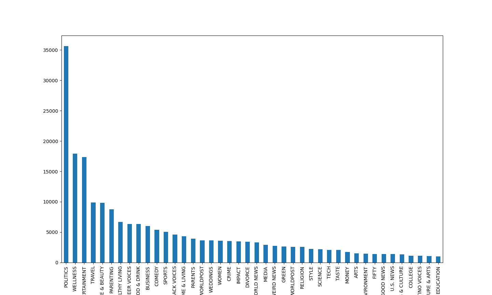

# News-Category-Prediction


## 1. Introduction

The task of the project is to predict the category of a news item based on its headline and short discription. I think this task is interesting and also useful for news websites or apps. There are  thousands of news every day. It will take a lot of time if classifying them by people. So, if there's a tool that can classify news according to headlines and short descriptions automatically, it will be helpful to enhace the efficience.

## 2.Data

### dataset

The dataset is from Kaggle: [News Category Dataset](https://www.kaggle.com/datasets/rmisra/news-category-dataset?resource=download)

>This dataset contains around 210k news headlines from 2012 to 2022 from HuffPost. This is one of the biggest news datasets and can serve as a benchmark for a variety of computational linguistic tasks. HuffPost stopped maintaining an extensive archive of news articles sometime after this dataset was first collected in 2018, so it is not possible to collect such a dataset in the present day. Due to changes in the website, there are about 200k headlines between 2012 and May 2018 and 10k headlines between May 2018 and 2022.

The raw data is a json file. Every item contains "link", "headline", "category", "short_discription", "authors", "date".

Example:

````
{"link": "https://www.huffpost.com/entry/covid-boosters-uptake-us_n_632d719ee4b087fae6feaac9",
"headline": "Over 4 Million Americans Roll Up Sleeves For Omicron-Targeted COVID Boosters", 
"category": "U.S. NEWS", 
"short_description": "Health experts said it is too early to predict whether demand would match up with the 171 million doses of the new boosters the U.S. ordered for the fall.", 
"authors": "Carla K. Johnson, AP", 
"date": "2022-09-23"}

{"link": "https://www.huffpost.com/entry/american-airlines-passenger-banned-flight-attendant-punch-justice-department_n_632e25d3e4b0e247890329fe", 
"headline": "American Airlines Flyer Charged, Banned For Life After Punching Flight Attendant On Video", 
"category": "U.S. NEWS", 
"short_description": "He was subdued by passengers and crew when he fled to the back of the aircraft after the confrontation, according to the U.S. attorney's office in Los Angeles.", 
"authors": "Mary Papenfuss", 
"date": "2022-09-23"}
````

### data analysis and process
There are 41 categories in total.

```
{'POLITICS': 35602, 'WELLNESS': 17945, 'ENTERTAINMENT': 17362, 'TRAVEL': 9900, 'STYLE & BEAUTY': 9814, 'PARENTING': 8791, 
'HEALTHY LIVING': 6694, 'QUEER VOICES': 6347, 'FOOD & DRINK': 6340, 'BUSINESS': 5992, 'COMEDY': 5400, 'SPORTS': 5077, 
'BLACK VOICES': 4583, 'HOME & LIVING': 4320, 'PARENTS': 3955, 'THE WORLDPOST': 3664, 'WEDDINGS': 3653, 'WOMEN': 3572, 
'CRIME': 3562, 'IMPACT': 3484, 'DIVORCE': 3426, 'WORLD NEWS': 3299, 'MEDIA': 2944, 'WEIRD NEWS': 2777, 
'GREEN': 2622, 'WORLDPOST': 2579, 'RELIGION': 2577, 'STYLE': 2254, 'SCIENCE': 2206, 'TECH': 2104, 'TASTE': 2096, 
'MONEY': 1756, 'ARTS': 1509, 'ENVIRONMENT': 1444, 'FIFTY': 1401, 'GOOD NEWS': 1398, 'U.S. NEWS': 1377, 
'ARTS & CULTURE': 1339, 'COLLEGE': 1144, 'LATINO VOICES': 1130, 'CULTURE & ARTS': 1074, 'EDUCATION': 1014}

```



First remove the categories with data less than 5000, then there are 11 categories left:

```
{'POLITICS': 35602, 
'WELLNESS': 17945, 
'ENTERTAINMENT': 17362, 
'TRAVEL': 9900, 
'STYLE & BEAUTY': 9814, 
'PARENTING': 8791, 
'HEALTHY LIVING': 6694, 
'FOOD & DRINK': 6340, 
'BUSINESS': 5992, 
'COMEDY': 5400, 
'SPORTS': 5077}
```

Then do the text pre-processing:
1. Delete unneeded keywords, such as *author*, *link*..., and keep only the *headline* and *short_description*. Combine *headline* and *short_description* into ***text***.
2. text processing
   1. Remove numbers, punctuations and stop words in text.
   2. turn all words into lowercase.
   3. do stemming and lemmatization
   4. examples: 
      ```
      # before
      {'link': 'https://www.huffpost.com/entry/blade-runner-2099-series-announced_n_63247adfe4b027aa40656cc0', 
      'headline': "Amazon Greenlights 'Blade Runner 2099' Limited Series Produced By Ridley Scott", 
      'category': 'ENTERTAINMENT', 
      'short_description': 'The director of the original 1982 film joins a writer of the 2017 sequel for the newest installment in the sci-fi franchise.', 
      'authors': 'Marco Margaritoff', 
      'date': '2022-09-16'}
      
      # after
      {'category': 'ENTERTAINMENT', 
      'text': 'amazon greenlight blade runner limit seri produc ridley scott director origin film join writer sequel newest instal scifi franchis'}
      ```

Finally, Split data into train/dev/test with `train_test_spint()`, and saved them as a .py file respectively. The ratio of train, dev, test is 8:1:1.
```commandline
train_data: 103133
dev_data: 12892
test_data: 12892
```

All operations above were finished in `data_process.py`.

## 3. Dev set results
Models: Naive Bayes `MultinomialNB()`, logistic regression `LogisticRegression()` and decision tree `DecisionTreeClassifier()`.

Features: unigram `CountVectorizer()`, bigram `CountVectorizer(ngram_range=(2, 2))` and tf-idf `TfidfVectorizer()`.

The result (accuracy scores) of using every feature on each model with default parameters are as follows:

| | Naive Bayes | Logistic Regression |Decition Tree
|---|-------------|---------------------|---|
|unigram| **75.52**   | **76.72**           |61.38|
|bigram| 68.56       | 64.32               |55.51|
|tf-idf| 63.61       | **77.38**           |59.88|

Top 3 configurations are:
1. unigram & Naive Bayes (NB)
2. unigram & Logistic Regression (LR)
3. tf-idf & Logistic Regression (LR)

Fine tune these 3 configurations with different hyperparameters:
```commandline
parameters = [0.001, 0.005, 0.01, 0.05, 0.1, 0.5, 1.0]
```
The accuracy scores are as follows:

| k/C   | unigram & NB | unigram & LR | tf-idf & LR |
|-------|--------------|--------------|-------------|
| 0.001 | 73.24  | 59.32        | 27.50       |
| 0.005 | 73.40  | 69.36        | 32.20       |
| 0.01  | 74.41        | 72.22        | 45.29       |
| 0.05  |75.34| 76.56        | 66.25       |
| 0.1   |75.86| **77.21**    | 70.93       |
| 0.5   |**76.49**|77.13| 70.93       |
|1.0|75.53|76.72| **77.38**   |


If using **unigram & NB**, the best performance is when k = 0.5.
If using **unigram & LR**, the best performance is when C = 0.1.
If using **tf-idf & LR**, the best performance is when C = 1.0.

Next is to use these three configurations to test on the test set.


## 4. Test set results

### accuracy

|unigram & NB(k = 0.5)|unigram & LR(C=0.1)| tf-idf & LR(C=1.0) |
|---|---|--------------------|
|76.92|78.22| **78.30**          |

### classification report 
#### tf-idf & Logistic Regrssion(C=1.0)


|                | precision | recall | f1-score | support |
|----------------|-----------|--------|----------|---------
| BUSINESS       | 0.72      | 0.57   | 0.64     | 584     |
| COMEDY         | 0.67      | 0.43   | 0.53     | 534     |
 | ENTERTAINMENT  | 0.76      | 0.81   | 0.78     | 1685    
 | FOOD & DRINK   | 0.81      | 0.80   | 0.80     | 642     
| HEALTHY LIVING | 0.55      | 0.21   | 0.31     | 671     
| PARENTING      | 0.76      | 0.72   | 0.74     | 872     
| POLITICS       | 0.86      | 0.93   | 0.89     | 3594    
| SPORTS         | 0.84      | 0.76   | 0.80     | 524     
| STYLE & BEAUTY | 0.88      | 0.82   | 0.85     | 1019    
| TRAVEL         | 0.82      | 0.83   | 0.82     | 954     
| WELLNESS       | 0.66      | 0.83   | 0.74     | 1813    
|---| ---       | ---    | ---      |---|
| accuracy       |           |        | 0.78     | 12892      
| macro avg      | 0.76      | 0.70   | 0.72     | 12892   
| weighted avg   | 0.78      | 0.78   | 0.77     | 12892   

All operations in 3 & 4 were finished in `train.py`.

## 5. Discussion
In all three models, unigram performed better than bigram. It's probably because in this dataset, the frequency of every bigram is quite average after moving stop words. I did a count and found that each bigram basically only occurred once or twice.

In Logistic Regression model, tf-idf performed better than CountVectorizer(), probablly because tf-idf has better linearly speratable classes.

## 6. Conclusion

In conclusion, this model performs pretty well on most categories, achieved 78.3% accuracy with LR model and tf-idf feature. 

A few categories don't get good scores like "COMEDY" and "HEALTHY LIVING", one possible reason is that those categories might be related with some other categories, which could influence the result.


